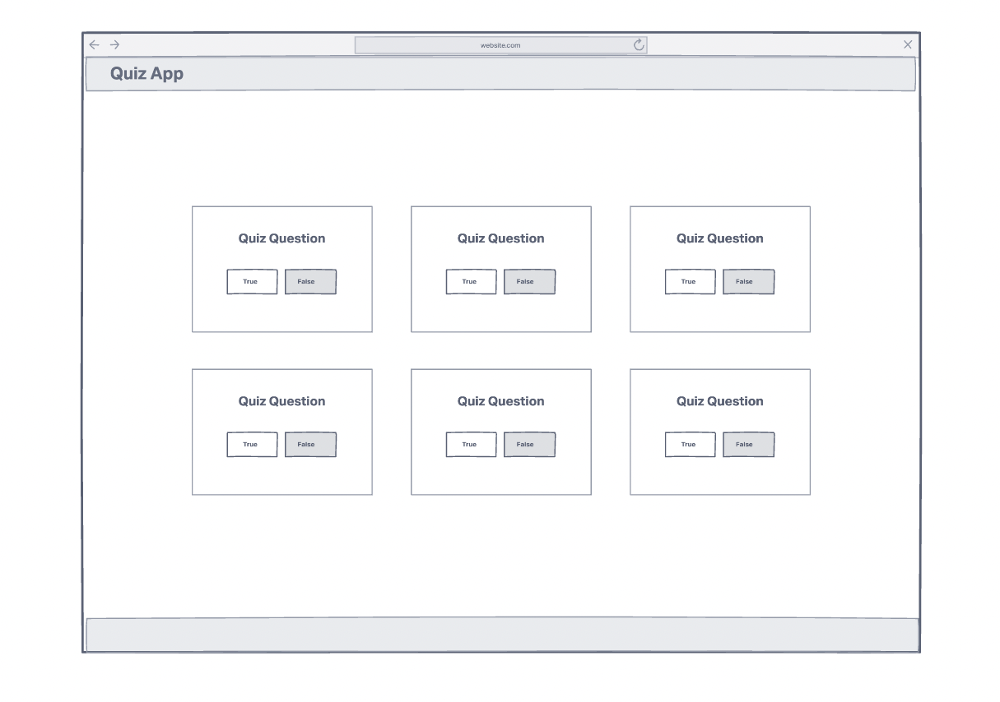

# Quiz App

## Description
A simple web app that presents quiz questions to a user so that they can take quizzes.

## Technologies Used
- HTML5
- CSS3
- JavaScript/jQuery
- Open Trivia Database API
- Git/Github - Github Pages for Hosting

## Screenshots

## Getting Started

[Click here](#) to visit the deployed app!

## Future Enhancements
- Adding a feature that allows users to create accounts to save data
- Adding a feature that allows a user to score points when they answer quiz questions correctly
- Adding a feature that allows persistence of high scores